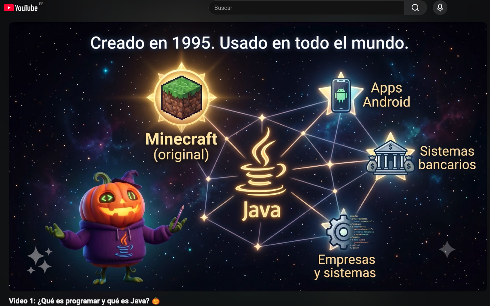
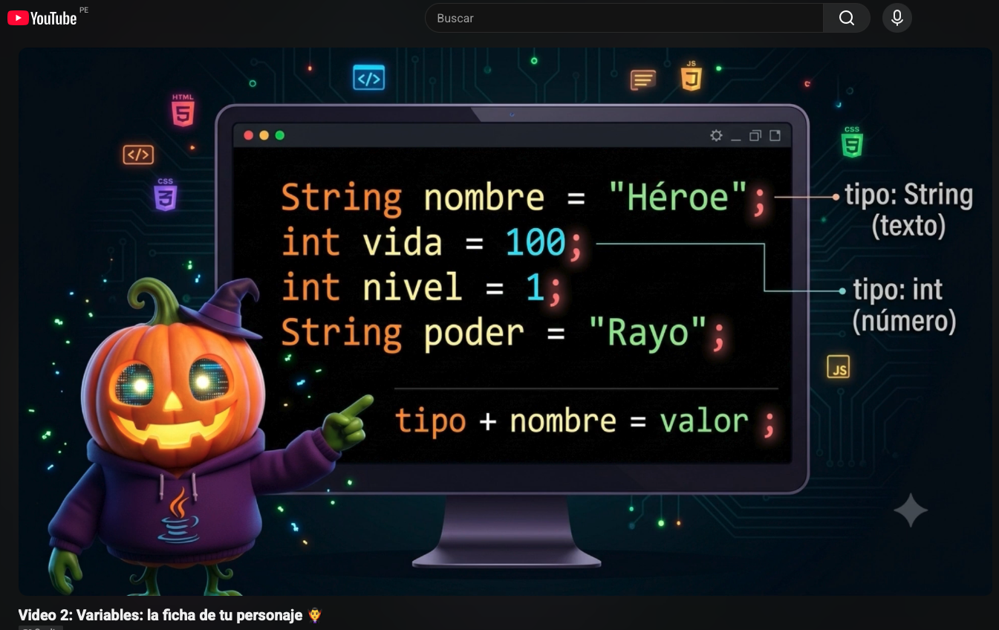
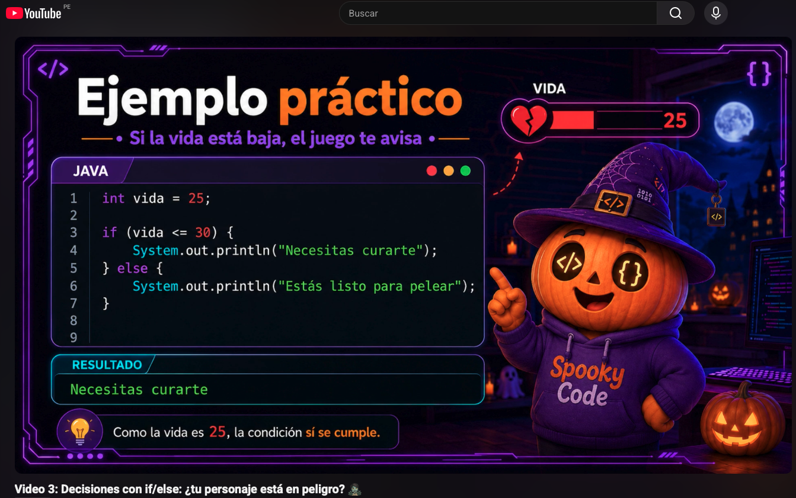
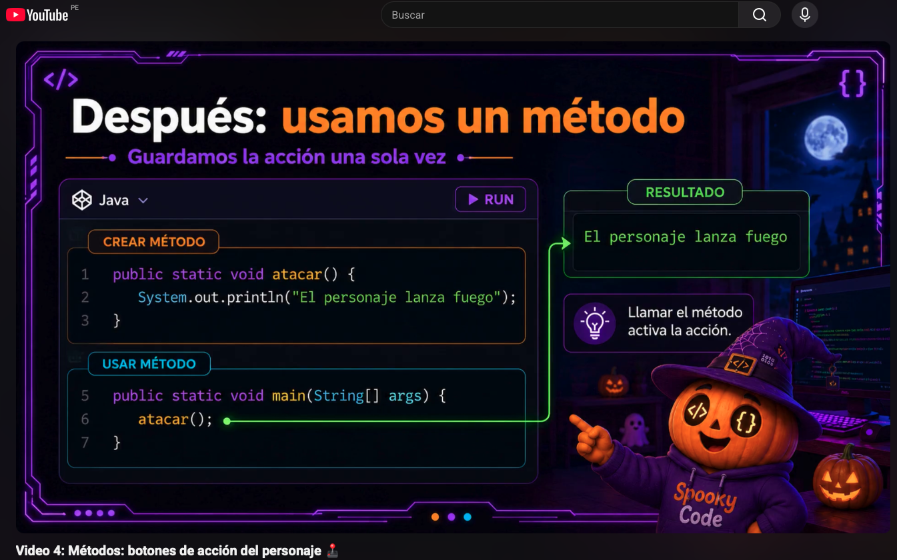
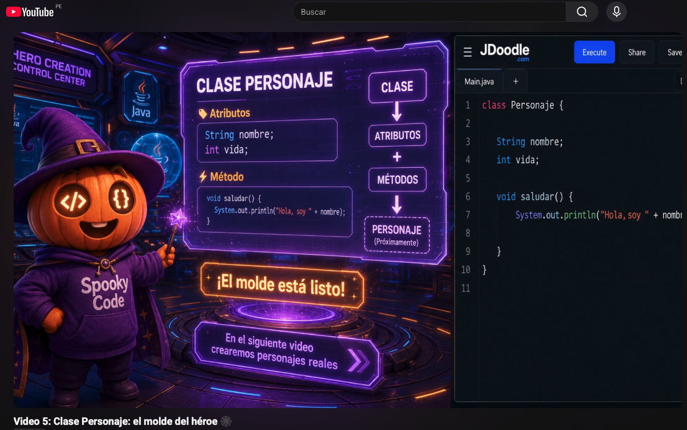
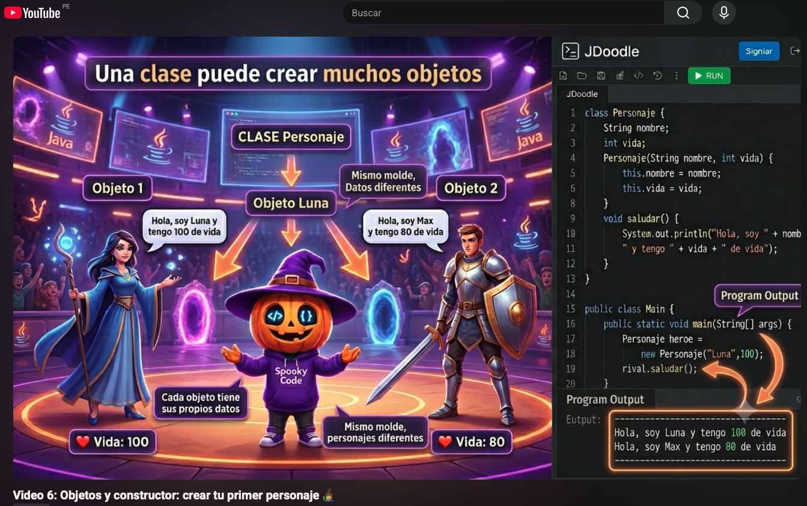
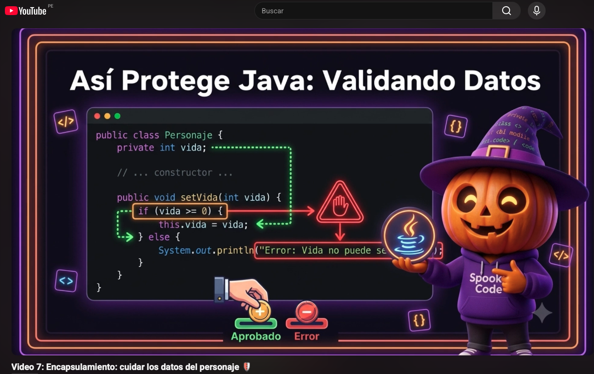
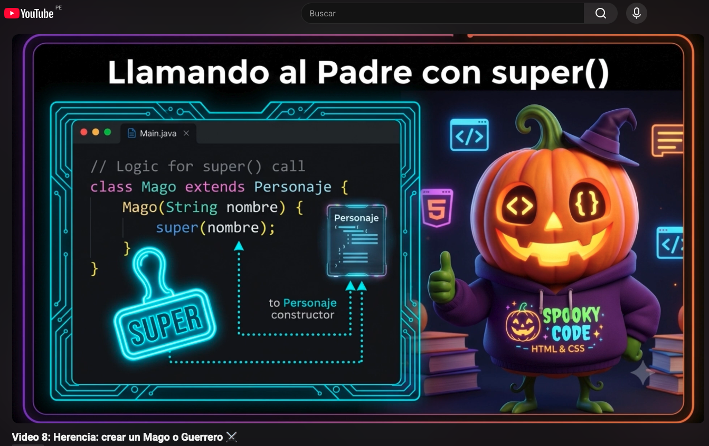
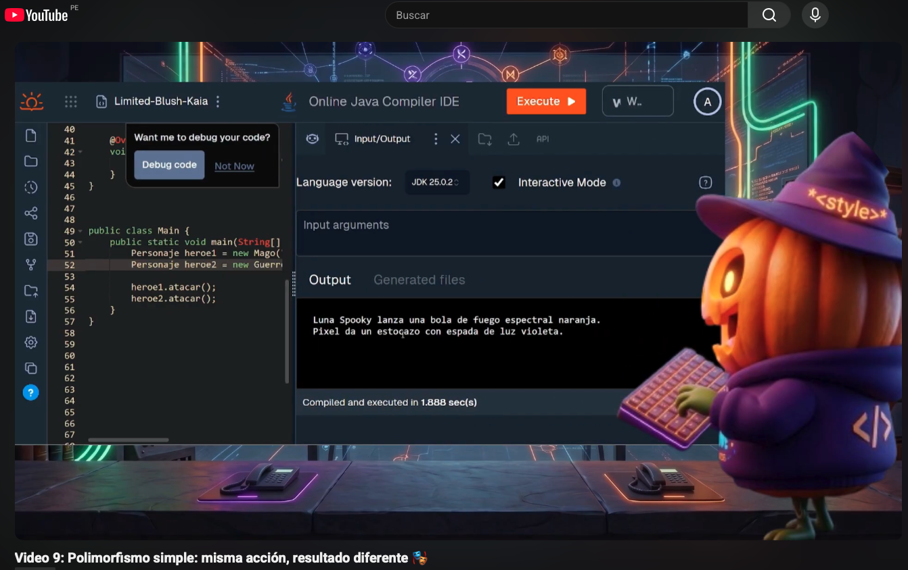
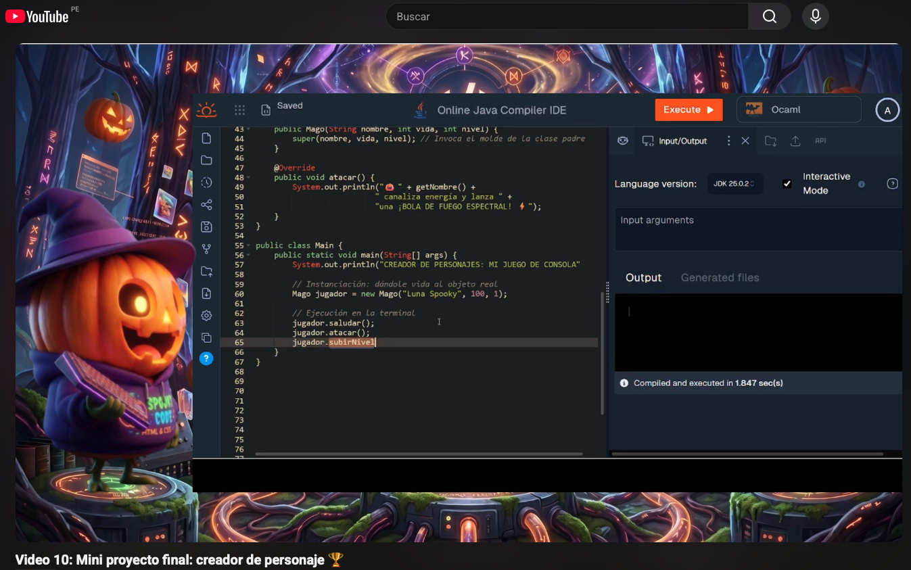

# 🎃 ¡Bienvenidos a Fundamentos de Java y POO!

¡Hola! Qué genial que estés aquí. En este curso introductorio vas a aprender a programar desde cero usando **Java**. No vas a tener que instalar absolutamente nada aburrido ni complicado; todo lo haremos directamente en tu navegador usando **JDoodle**.

A lo largo de estos 10 videos cortos, iremos construyendo paso a paso tu propio personaje de videojuego mientras aprendemos los superpoderes de la Programación Orientada a Objetos (POO). ¡Sigue el paso a paso y diviértete programando!

---

🦇 *Proyecto desarrollado para el curso de 1ASI0729 Desarrollo de Aplicaciones Open Source - Ingeniería de Software - UPC (Periodo 202610)*.
**Equipo InnovaTech:**
* Lopez Monroy, Rodrigo Alfredo (U202421866)
* Luis Miranda, Diego Andres (U20241D185)
* Mamani Vilca, Alan Jaivi (U20241E299)
* 
* 
  
**📂 Repositorio de código fuente**: [https://github.com/InnovaTechStudio/java-fundamentals-course-innovatech](https://github.com/InnovaTechStudio/java-fundamentals-course-innovatech/tree/main)

* **Público objetivo**: Estudiantes de 12 a 17 años sin experiencia en programación.
* **Prerrequisitos**: Ninguno.
* **Herramientas necesarias**: **¡Solo tu navegador web!** (Chrome, Firefox, Safari, Edge).

---

## 👻 Lecciones del Curso

### Video 1: ¿Qué es programar y qué es Java? 🎃

¡Bienvenido a tu primera aventura en código! Hoy descubriremos qué es Java y cómo darle las primeras instrucciones a nuestra computadora.
* 🎥 **Ver video:** https://www.youtube.com/watch?v=ymKrB7RO08I
* 📜 **Plantilla para practicar:** [Abre la plantilla inicial](https://www.jdoodle.com/ia/1U9Q)
* 🎃 **Estado completado:** [Mira el código resuelto](https://www.jdoodle.com/ia/1U9N)

### Video 2: Variables: la ficha de tu personaje 🧛‍♂️

¡Es hora de darle identidad a tu héroe! Aprenderemos a guardar datos como nombre, vida y nivel usando variables.
* 🎥 **Ver video:** https://www.youtube.com/watch?v=6iX7BngRjig
* 📜 **Plantilla para practicar:** [Abre la plantilla inicial](https://www.jdoodle.com/ia/1U9R)
* 🎃 **Estado completado:** [Mira el código resuelto](https://www.jdoodle.com/ia/1U9S)

### Video 3: Decisiones con if/else: ¿tu personaje está en peligro? 🧟

¡Cuidado con los monstruos! Hoy le enseñaremos a nuestro programa a tomar decisiones y alertar a tu personaje si su vida baja.
* 🎥 **Ver video:** https://www.youtube.com/watch?v=3r95JFjG95Y
* 📜 **Plantilla para practicar:** [Abre la plantilla inicial](https://www.jdoodle.com/ia/1U9T)
* 🎃 **Estado completado:** [Mira el código resuelto](https://www.jdoodle.com/ia/1U9U)

### Video 4: Métodos: botones de acción del personaje 🕹️

¡Agreguemos controles a nuestro juego! Descubre cómo los métodos funcionan como botones secretos para que tu personaje ataque.
* 🎥 **Ver video:** https://www.youtube.com/watch?v=ugVDlkgMXxk
* 📜 **Plantilla para practicar:** [Abre la plantilla inicial](https://www.jdoodle.com/ia/1U9V)
* 🎃 **Estado completado:** [Mira el código resuelto](https://www.jdoodle.com/ia/1U9W)

### Video 5: Clase Personaje: el molde del héroe 🕸️

¡Vamos a la fábrica de héroes! Aprenderemos qué es una "Clase" en Java y cómo usarla como un molde para diseñar personajes.
* 🎥 **Ver video:** https://www.youtube.com/watch?v=DVu2hzjPBm0
* 📜 **Plantilla para practicar:** [Abre la plantilla inicial](https://www.jdoodle.com/ia/1U9X)
* 🎃 **Estado completado:** [Mira el código resuelto](https://www.jdoodle.com/ia/1U9Y)

### Video 6: Objetos y constructor: crear tu primer personaje 🧙‍♂️

¡Es hora de darle vida a nuestro molde! Usaremos la magia de los "Constructores" para invocar personajes reales y únicos.
* 🎥 **Ver video:** https://www.youtube.com/watch?v=i0aa2vVTpOU
* 📜 **Plantilla para practicar:** [Abre la plantilla inicial](https://www.jdoodle.com/ia/1U9Z)
* 🎃 **Estado completado:** [Mira el código resuelto](https://www.jdoodle.com/ia/1Ua0)

### Video 7: Encapsulamiento: cuidar los datos del personaje 🛡️

¡Protege tus puntos de vida! Aprenderemos qué es el Encapsulamiento para asegurar que nadie le baje la vida a tu personaje haciendo trampa.
* 🎥 **Ver video:** https://www.youtube.com/watch?v=itYNa4or4gg
* 📜 **Plantilla para practicar:** [Abre la plantilla inicial](https://www.jdoodle.com/ia/1Ua1)
* 🎃 **Estado completado:** [Mira el código resuelto](https://www.jdoodle.com/ia/1Ua2)

### Video 8: Herencia: crear un Mago o Guerrero ⚔️

¿Lanzar hechizos o usar una espada? Aprenderemos sobre Herencia para crear clases especiales basadas en tu Personaje original.
* 🎥 **Ver video:** https://www.youtube.com/watch?v=FuyLyiaWJyc
* 📜 **Plantilla para practicar:** [Abre la plantilla inicial](https://www.jdoodle.com/ia/1Ua3)
* 🎃 **Estado completado:** [Mira el código resuelto](https://www.jdoodle.com/ia/1Ua4)

### Video 9: Polimorfismo simple: misma acción, resultado diferente 🎭

¡Todos atacan, pero distinto! Descubre el Polimorfismo: un solo comando de ataque, pero con efectos mágicos o físicos según el héroe.
* 🎥 **Ver video:** https://www.youtube.com/watch?v=kynBr5sVTvg
* 📜 **Plantilla para practicar:** [Abre la plantilla inicial](https://www.jdoodle.com/ia/1Ua5)
* 🎃 **Estado completado:** [Mira el código resuelto](https://www.jdoodle.com/ia/1Ua6)

### Video 10: Mini proyecto final: creador de personaje 🏆

¡La batalla final ha llegado! Uniremos todas las piezas de nuestro código para tener a nuestro héroe saludando, atacando y subiendo de nivel.
* 🎥 **Ver video:** https://www.youtube.com/watch?v=5ItiOtiVvjM
* 📜 **Plantilla para practicar:** [Abre la plantilla inicial](https://www.jdoodle.com/ia/1Ua7)
* 🎃 **Estado completado:** [Mira el código resuelto](https://www.jdoodle.com/ia/1Ua8)
